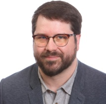
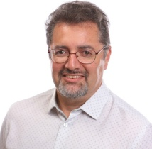
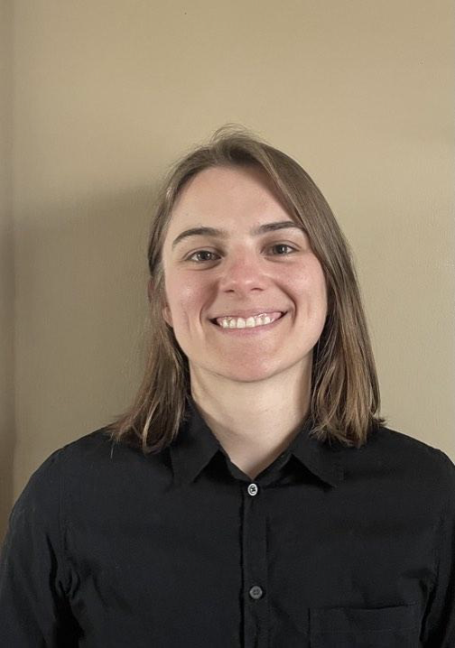

# Meet Your Faculty

<!--#### NAME

>JOB TITLE  
INSTITUTION  
LOCATION
>
> --- CONTACT INFO, IF PROVIDED

BIO GOES HERE-->

### Instructors

#### Dr. Dan Gaston (he/him)

>Clinical Bioinformatician/Assistant Professor  
NS Health and Dalhousie University   
Halifax, NS, Canada 
>
> --- daniel.gaston@dal.ca 

Dan Gaston is a Clinical Bioinformatician working at NS Health in the Molecular Diagnostics Lab and an Assistant Professor in the Department of Pathology at Dalhousie University. His work and research focuses on high-throughput genomic and transcriptomic profiling of solid tumours and hematological cancers of patients in Nova Scotia and the rest of Atlantic Canada. He also works on the design and application of bioinformatics tools in clinical care and translational research settings.

#### Dr. Victor Martinez

>Clinical Genomics Specialist and Lead of Data Analytics/Assistant Professor  
IWK Health and Dalhousie University  
Halifax, NS, Canada
>

<!--BIO GOES HERE -->

### Teaching Assistants

#### Riley Arseneau (she/her)

>PhD Student  
Dalhousie University  
Halifax, Nova Scotia, Canada 
>
> --- Rarseneau@dal.ca

Riley Arseneau (she/her) is a fourth-year PhD Student investigating the correlations between genetics, immune cells, and pancreatic cancer in the Boudreau lab at Dalhousie University. 

#### Sarah Russell (she/her)

>Genetic Analysis Specialist   
IWK Health  
Halifax, Nova Scotia, Canada 
>
> --- sarah.russell@iwk.nshealth.ca 

Sarah Russell is a Genetic Analysis Specialist at IWK Health, where she applies bioinformatics tools to support the clinical interpretation of genomic data. Her work focuses on developing and maintaining NGS workflows that ensure the accuracy and quality of genetic test results and clinical reporting. Her previous work involved the development and validation of bioinformatic solutions for somatic profiling of solid tumor panels used in clinical diagnostics.

### Facilitator

#### Ben Fisher (he/him)

>Regional Coordinator, CBH Atlantic  
Canadian Bioinformatics Hub, Dalhousie University   
Halifax, NS, Canada 
>
> --- atlantic@bioinformatics.ca 

Ben has a Master of Science degree in Microbiology and Immunology, completing his bioinformatics training under Dr. Morgan Langille at Dalhousie University. Throughout his training, he has instructed others in genetics, molecular biology, and microbiome data science. Ben is passionate about continued education of trainees and professionals, and firmly believes that enhancing bioinformatics and computational biology competencies will support the success of Canada’s current and future scientists.

